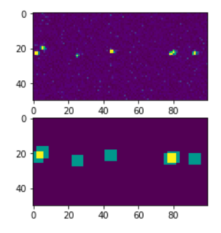

Initial Pass Through Image
==========================

For each pixel above threshold the code looks to see if this is the highest
making a first pass. in the box (n x n) surrounding the pixel. If this is
the highest in the box, then the location is stored in a list of potential
photons.

In addition to storing the location of potential photons, an image is formed
with its value incremented by one for the box (n x n) around the pixel. This
image initially starts with all values set to zero. After the images have
been processed, this image can be used to find overlap between photon events.
An example of such an image is shown in :ref:`first_pass_image`

A graphical (flow chart) representation of the logic is shown in
:ref:`first_pass_digraph`.

.. _first_pass_image:

   First pass image output

   (top) Actual CCD image showing photon events.
   (bottom) Image output from first pass showing potential photon locations

.. _first_pass_digraph:

.. digraph:: first_pass
   :caption: First pass through all images

   node[shape="box", style=rounded]
      start; end;
   node[shape="diamond", style=""]
      is_last_pixel[label="is last pixel?"]
      is_pixel_above_thresh[label="is pixel above\nthreshold"]
      is_pixel_highest[label="is pixel highest\nvalue in nxn box"]
   node[shape="parallelogram", style=""]
      get_pixel[label="get pixel value"]
   node[shape="box", style=""]
      set_start_pixel[label="move to first pixel"]
      move_to_next_pixel[label="move to next pixel"]
      store_loc[label="add location of\nphoton to photon list"]
      mark_loc[label="mark location\nof nxn box in image"]

   start -> set_start_pixel
   set_start_pixel -> get_pixel
   get_pixel -> is_pixel_above_thresh

   is_pixel_above_thresh -> is_last_pixel[label="no"]
   is_pixel_above_thresh -> is_pixel_highest[label="yes"]

   is_pixel_highest -> is_last_pixel[label="no"]
   is_pixel_highest -> store_loc[label="yes"]
   store_loc -> mark_loc
   mark_loc -> is_last_pixel

   move_to_next_pixel -> get_pixel
   is_last_pixel -> move_to_next_pixel[label="no"]
   is_last_pixel -> end[label="yes"]
